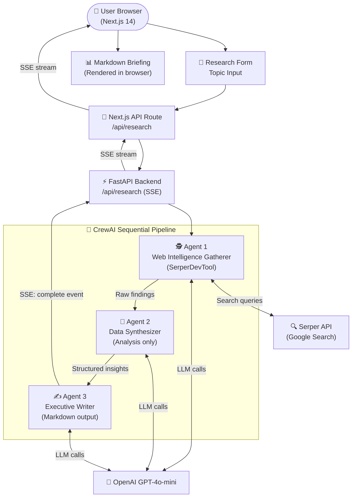

<div align="center">

# 🤖 Multi-Agent Research Intelligence System

**Transform any topic into a boardroom-ready Corporate Intelligence Briefing in under 60 seconds.**  
Three specialized CrewAI agents collaborate in real-time — searching the web, synthesizing data, and writing executive-grade markdown reports — all streamed live to a stunning Next.js interface.

[](https://vercel.com/new/clone?repository-url=https://github.com/Shriyanshu2004/Multi-Agent-Workflow)
[](LICENSE)
[](https://nextjs.org)
[](https://crewai.com)
[](https://fastapi.tiangolo.com)

</div>

---

## 📸 Demo

> Enter a topic like *"AI in Healthcare 2025"* → watch 3 agents activate sequentially → receive a full structured briefing with trends table, strategic implications, risk factors, and sources.

---

## ✨ Features

| Feature | Description |
|---------|-------------|
| 🕵️ **Agent 1 — Web Scraper** | Uses Serper/Google to find 8–12 recent, credible data points |
| 🧠 **Agent 2 — Synthesizer** | Cross-references facts, extracts trends, assigns confidence levels |
| ✍️ **Agent 3 — Executive Writer** | Produces a structured Markdown briefing with tables & sections |
| ⚡ **Live SSE Streaming** | Real-time agent progress streamed via Server-Sent Events |
| 📋 **Rich Markdown Output** | GFM tables, syntax-highlighted code, copy + download buttons |
| 🌙 **Dark Glassmorphism UI** | Animated gradient backgrounds, glass cards, micro-animations |
| 🚀 **Vercel-Ready** | One-click deployment as a Python + Node.js monorepo |

---

## 🏗️ System Architecture



---

## 📁 Project Structure

```
multi-agent-research-system/
├── frontend/                    # Next.js 14 App Router
│   ├── app/
│   │   ├── api/research/        # SSE proxy route handler
│   │   │   └── route.ts
│   │   ├── globals.css          # Glassmorphism + markdown styles
│   │   ├── layout.tsx           # Root layout + SEO metadata
│   │   └── page.tsx             # Main UI with SSE client logic
│   ├── components/
│   │   ├── ResearchForm.tsx     # Topic input with example chips
│   │   ├── AgentStatusPanel.tsx # Live agent progress cards
│   │   └── MarkdownReport.tsx   # Report renderer + copy/download
│   ├── lib/
│   │   └── types.ts             # TypeScript types for SSE events
│   ├── package.json
│   ├── tailwind.config.ts
│   └── next.config.ts
│
├── backend/                     # FastAPI + CrewAI
│   ├── main.py                  # FastAPI app + SSE endpoint
│   ├── agents.py                # 3 CrewAI agent definitions
│   ├── tasks.py                 # Task descriptions + context chaining
│   ├── tools.py                 # SerperDevTool wrapper
│   ├── crew.py                  # Crew assembly + async stream generator
│   └── requirements.txt
│
├── vercel.json                  # Monorepo routing config
├── .gitignore
└── README.md
```

---

## ⚙️ Local Setup Guide

### Prerequisites

- **Node.js** ≥ 18.x ([download](https://nodejs.org))
- **Python** ≥ 3.10 ([download](https://python.org))
- **API Keys**:
  - `OPENAI_API_KEY` — [platform.openai.com](https://platform.openai.com/api-keys)
  - `SERPER_API_KEY` — [serper.dev](https://serper.dev) (free tier: 2,500 searches/month)

---

### Step 1 — Clone the Repository

```bash
git clone https://github.com/Shriyanshu2004/Multi-Agent-Workflow.git
cd Multi-Agent-Workflow
```

### Step 2 — Set Up the Python Backend

```bash
cd backend

# Create and activate a virtual environment
python -m venv .venv
# Windows:
.venv\Scripts\activate
# macOS/Linux:
source .venv/bin/activate

# Install dependencies
pip install -r requirements.txt

# Configure environment variables
cp .env.example .env
# Open .env and fill in your API keys:
#   OPENAI_API_KEY=sk-...
#   SERPER_API_KEY=...
```

### Step 3 — Start the FastAPI Backend

```bash
# From the /backend directory (with venv activated)
python main.py
# → Running on http://localhost:8000
# → API docs at http://localhost:8000/api/docs
```

### Step 4 — Set Up the Next.js Frontend

```bash
# In a new terminal tab
cd frontend

# Install Node dependencies
npm install

# Configure environment variables
cp .env.local.example .env.local
# .env.local already contains: NEXT_PUBLIC_BACKEND_URL=http://localhost:8000
```

### Step 5 — Start the Frontend

```bash
# From /frontend
npm run dev
# → Running on http://localhost:3000
```

### Step 6 — Use the App

1. Open [http://localhost:3000](http://localhost:3000)
2. Type a research topic (e.g., *"Generative AI in Finance 2025"*)
3. Click **Generate Briefing**
4. Watch the 3 agents activate in real-time
5. Read, copy, or download your Corporate Intelligence Briefing 🎉

---

## 🚀 Deploying to Vercel

### Option A — One-Click (Recommended)

[](https://vercel.com/new/clone?repository-url=https://github.com/Shriyanshu2004/Multi-Agent-Workflow)

### Option B — Manual Deployment

```bash
# Install Vercel CLI
npm i -g vercel

# From the project root
vercel

# Follow prompts, then set environment variables:
vercel env add OPENAI_API_KEY
vercel env add SERPER_API_KEY
vercel env add NEXT_PUBLIC_BACKEND_URL   # set to your Vercel deployment URL
vercel env add ALLOWED_ORIGINS           # set to your Vercel deployment URL

# Deploy to production
vercel --prod
```

### Required Environment Variables

Set these in **Vercel Dashboard → Project → Settings → Environment Variables**:

| Variable | Required | Description | Example |
|----------|----------|-------------|---------|
| `OPENAI_API_KEY` | ✅ | OpenAI API key | `sk-proj-...` |
| `SERPER_API_KEY` | ✅ | Serper (Google Search) key | `abc123...` |
| `NEXT_PUBLIC_BACKEND_URL` | ✅ | URL of your deployed backend | `https://your-app.vercel.app` |
| `ALLOWED_ORIGINS` | ✅ | CORS allowed origins | `https://your-app.vercel.app` |
| `OPENAI_MODEL_NAME` | ⚙️ | LLM model (default: gpt-4o-mini) | `gpt-4o` |

---

## 🧠 Agent Deep-Dive

### Agent 1 — Web Intelligence Gatherer 🕵️

| Property | Value |
|----------|-------|
| **Role** | Senior Research Analyst |
| **Tool** | `SerperDevTool` (Google Search, 10 results) |
| **Goal** | Gather 8–12 credible data points with sources and recency |
| **LLM** | GPT-4o-mini, temp=0.3 |
| **Max Iterations** | 5 |

### Agent 2 — Data Synthesizer 🧠

| Property | Value |
|----------|-------|
| **Role** | Intelligence Analyst |
| **Tool** | None (pure reasoning on Task 1 output) |
| **Goal** | Extract 5–7 trends, validate cross-references, assign confidence levels |
| **Context** | Receives Task 1 output automatically via CrewAI context chaining |

### Agent 3 — Executive Writer ✍️

| Property | Value |
|----------|-------|
| **Role** | Corporate Communications Director |
| **Tool** | None (pure generation from Task 2 output) |
| **Goal** | Produce 8-section Markdown briefing with tables, headers, and sources |
| **Context** | Receives Task 2 output automatically via CrewAI context chaining |

---

## 🔮 Future Scope & Plus-One Enhancements

### 🔧 Short-Term
- [ ] **Persistent History** — Store past briefings in PostgreSQL/Supabase with user accounts (NextAuth.js)
- [ ] **PDF Export** — Server-side PDF generation via `pdfmake` or `wkhtmltopdf`
- [ ] **Topic Presets** — Industry-specific prompt templates (VC Research, Competitive Analysis, Regulatory Scan)

### 🚀 Medium-Term
- [ ] **Parallel Agent Execution** — Switch `Process.sequential` → `Process.hierarchical` with a Manager LLM for 2× speed
- [ ] **Custom Tool Registry** — Allow users to plug in their own search APIs (Tavily, Exa.ai, Brave Search)
- [ ] **Source Citation Links** — Hyperlink every claim in the briefing back to its original source URL
- [ ] **Briefing Comparison** — Run the same topic at T1 and T2, highlight what changed (delta analysis)

### 🌟 Long-Term
- [ ] **Multi-Language Output** — Generate briefings in French, German, Japanese via LLM translation layer
- [ ] **Slack / Teams Integration** — Webhook delivery of briefings directly to workspace channels
- [ ] **Agent Fine-Tuning** — Fine-tune writer agent on a corpus of McKinsey/BCG report style data
- [ ] **Streaming Token Display** — Show LLM token output character-by-character as Agent 3 writes

---

## 🛠️ Tech Stack

| Layer | Technology |
|-------|-----------|
| Frontend Framework | Next.js 14 (App Router, TypeScript) |
| Styling | Tailwind CSS 3 + Custom CSS |
| Markdown Rendering | react-markdown + remark-gfm + rehype-highlight |
| SSE Client | eventsource-parser |
| Agent Orchestration | CrewAI 0.30 |
| Backend Framework | FastAPI 0.111 |
| LLM Provider | OpenAI GPT-4o-mini |
| Search Tool | Serper API (SerperDevTool) |
| Streaming | Server-Sent Events (SSE) |
| Deployment | Vercel (Node + Python runtimes) |

---

## 📄 License

MIT © [Shriyanshu2004](https://github.com/Shriyanshu2004)

---

<div align="center">
  <sub>Built with ❤️ using CrewAI, Next.js, FastAPI, and OpenAI</sub>
</div>
